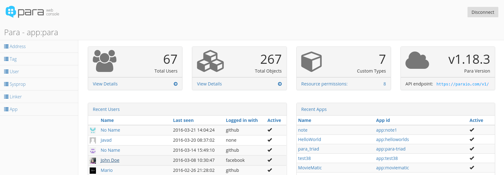

# Para Web Console

[](https://gitter.im/Erudika/para?utm_source=badge&utm_medium=badge&utm_campaign=pr-badge&utm_content=badge)

## What is this?

**Para** was designed as a simple and modular backend framework for object persistence and retrieval.
It helps you build applications faster by taking care of the backend. It works on three levels -
objects are stored in a NoSQL data store or any old relational database, then automatically indexed
by a search engine and finally, cached.

This is the basic, open source admin console for managing your own **Para** backend. 
**There's a much more advanced and feature-rich web UI at [ParaIO.com](https://paraio.com) - the hosted Para service.**



### Quick start

You don't have to install anything, just open the web UI and start using it!

### Open the Web Console from here: [console.paraio.org](https://console.paraio.org)

**NOTE:** If you connect to a Para server on `http://localhost` or other non-https domain, you should do so from 
[http://console.paraio.org](https://console.paraio.org). Some browsers don't allow HTTPS pages to make CORS requests to 
insecure HTTP endpoints.

### Run it locally

To run it locally, start up a web server like Express or Python:
```sh
$ cd docs && python -m SimpleHTTPServer 9000
```
**OR**:
```sh
$ npm run server
```
There's no need to run `npm install`.

The admin interface is **client-side only** and your secret key is *never* sent over the the network. Instead,
a JWT access token is generated locally and sent to the server on each request.

## ng-admin and Restangular

This project is based on [ng-admin](https://github.com/marmelab/ng-admin) and [Restangular](https://github.com/mgonto/restangular)
so be sure to check their docs first:

#### [ng-admin docs](http://ng-admin-book.marmelab.com)

#### [Restangular docs](https://github.com/mgonto/restangular#table-of-contents)

## Para documentation

### [Read the Docs](https://paraio.org/docs)

## Contributing

1. Fork this repository and clone the fork to your machine
2. Create a branch (`git checkout -b my-new-feature`)
3. Implement a new feature or fix a bug and add some tests
4. Commit your changes (`git commit -am 'Added a new feature'`)
5. Push the branch to **your fork** on GitHub (`git push origin my-new-feature`)
6. Create new Pull Request from your fork

For more information see [CONTRIBUTING.md](https://github.com/Erudika/para/blob/master/CONTRIBUTING.md)

## License
[Apache 2.0](LICENSE)
